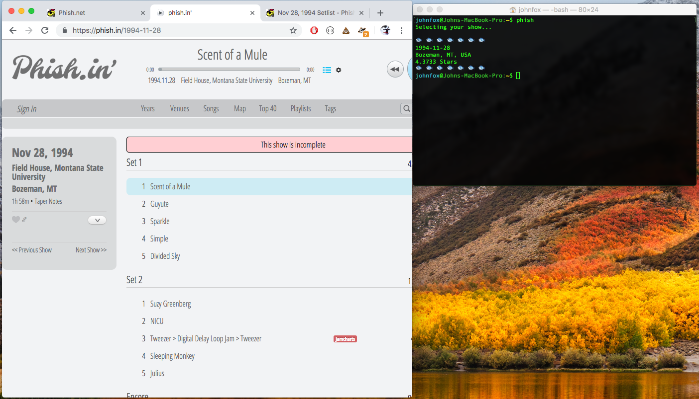

# Phish CLI

Opens a random show from phish.in and phish.net, straight from your terminal!

## Requirements

1. NodeJs and npm
2. Google Chrome
3. A phish.net account and API key
4. The helping phriendly book

## Install

1. Set PHISH_API_KEY environment variable to your API key
2. Run `npm install -g phish-cli`

## Credits

Credits to phish.net, the Mockingbird Foundation, and the phish.in team for making this possible!